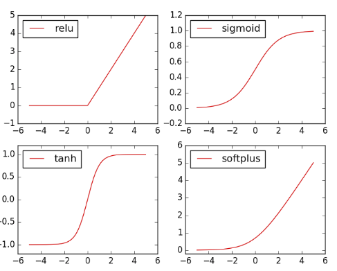

# Pytorch

## Notebook-Morvan course ☯️

### ➡ torch 与 numpy 无缝.

```python
# matrix multiplication 矩阵点乘
data = [[1,2], [3,4]]
tensor = torch.FloatTensor(data)  # 转换成32位浮点 tensor
# correct method
print(
    '\nmatrix multiplication (matmul)',
    '\nnumpy: ', np.matmul(data, data),     # [[7, 10], [15, 22]]
    '\ntorch: ', torch.mm(tensor, tensor)   # [[7, 10], [15, 22]]
)

# !!!!  下面是错误的方法 !!!!
data = np.array(data)
print(
    '\nmatrix multiplication (dot)',
    '\nnumpy: ', data.dot(data),        # [[7, 10], [15, 22]] 在numpy 中可行
    '\ntorch: ', tensor.dot(tensor)     # torch 会转换成 [1,2,3,4].dot([1,2,3,4) = 30.0
)
```

### ➡ Variable

Variable 是一个地址,里面保存的数是变化的.

```python
import torch
from torch.autograd import Variable # torch 中 Variable 模块

# 先生鸡蛋
tensor = torch.FloatTensor([[1,2],[3,4]])
# 把鸡蛋放到篮子里, requires_grad是参不参与误差反向传播, 要不要计算梯度
variable = Variable(tensor, requires_grad=True)

print(tensor)
"""
 1  2
 3  4
[torch.FloatTensor of size 2x2]
"""

print(variable)
"""
Variable containing:
 1  2
 3  4
[torch.FloatTensor of size 2x2]
"""
```

关于计算: **但 是时刻记住, Variable 计算时, 它在背景幕布后面一步步默默地搭建着一个庞大的系统, 叫做计算图, computational graph. 这个图是用来干嘛的? 原来是将所有的计算步骤 \(节点\) 都连接起来, 最后进行误差反向传递的时候, 一次性将所有 variable 里面的修改幅度 \(梯度\) 都计算出来, 而 tensor 就没有这个能力啦.**

### ➡ Activate Function

```python
import torch
import torch.nn.functional as F     # 激励函数都在这
from torch.autograd import Variable

# 做一些假数据来观看图像
x = torch.linspace(-5, 5, 200)  # x data (tensor), shape=(100, 1)
x = Variable(x)
x_np = x.data.numpy()   # 换成 numpy array, 出图时用

# 几种常用的 激励函数
y_relu = F.relu(x).data.numpy()
y_sigmoid = F.sigmoid(x).data.numpy()
y_tanh = F.tanh(x).data.numpy()
y_softplus = F.softplus(x).data.numpy()
# y_softmax = F.softmax(x)  softmax 比较特殊, 不能直接显示, 不过他是关于概率的, 用于分类

import matplotlib.pyplot as plt  # python 的可视化模块, 我有教程 (https://morvanzhou.github.io/tutorials/data-manipulation/plt/)

plt.figure(1, figsize=(8, 6))
plt.subplot(221)
plt.plot(x_np, y_relu, c='red', label='relu')
plt.ylim((-1, 5))
plt.legend(loc='best')

plt.subplot(222)
plt.plot(x_np, y_sigmoid, c='red', label='sigmoid')
plt.ylim((-0.2, 1.2))
plt.legend(loc='best')

plt.subplot(223)
plt.plot(x_np, y_tanh, c='red', label='tanh')
plt.ylim((-1.2, 1.2))
plt.legend(loc='best')

plt.subplot(224)
plt.plot(x_np, y_softplus, c='red', label='softplus')
plt.ylim((-0.2, 6))
plt.legend(loc='best')

plt.show()
```



### ➡ First NN

```python
# Regression Task

import torch
import matplotlib.pyplot as plt

x = torch.unsqueeze(torch.linspace(-1, 1, 100), dim=1)  # x data (tensor), shape=(100, 1)
y = x.pow(2) + 0.2*torch.rand(x.size())                 # noisy y data (tensor), shape=(100, 1)

# 画图 ,下句应该删除 data,否则有错
plt.scatter(x.data.numpy(), y.data.numpy())
plt.show()
#======set NN======#
import torch
import torch.nn.functional as F     # 激励函数都在这

class Net(torch.nn.Module):  # 继承 torch 的 Module
    def __init__(self, n_feature, n_hidden, n_output):
        super(Net, self).__init__()     # 继承 __init__ 功能
        # 定义每层用什么样的形式
        self.hidden = torch.nn.Linear(n_feature, n_hidden)   # 隐藏层线性输出
        self.predict = torch.nn.Linear(n_hidden, n_output)   # 输出层线性输出

    def forward(self, x):   # 这同时也是 Module 中的 forward 功能
        # 正向传播输入值, 神经网络分析出输出值
        x = F.relu(self.hidden(x))      # 激励函数(隐藏层的线性值)
        x = self.predict(x)             # 输出值
        return x

net = Net(n_feature=1, n_hidden=10, n_output=1)

print(net)  # net 的结构
"""
Net (
  (hidden): Linear (1 -> 10)
  (predict): Linear (10 -> 1)
)
"""
# training
# optimizer 是训练的工具
optimizer = torch.optim.SGD(net.parameters(), lr=0.2)  # 传入 net 的所有参数, 学习率
loss_func = torch.nn.MSELoss()      # 预测值和真实值的误差计算公式 (均方差)

for t in range(100):
    prediction = net(x)     # 喂给 net 训练数据 x, 输出预测值

    loss = loss_func(prediction, y)     # 计算两者的误差

    optimizer.zero_grad()   # 清空上一步的残余更新参数值
    loss.backward()         # 误差反向传播, 计算参数更新值
    optimizer.step()        # 将参数更新值施加到 net 的 parameters 上
    
# visualization
import matplotlib.pyplot as plt

plt.ion()   # 画图
plt.show()

for t in range(200):

    ...
    loss.backward()
    optimizer.step()

    # 接着上面来
    if t % 5 == 0:
        # plot and show learning process
        plt.cla()
        plt.scatter(x.data.numpy(), y.data.numpy())
        plt.plot(x.data.numpy(), prediction.data.numpy(), 'r-', lw=5)
        plt.text(0.5, 0, 'Loss=%.4f' % loss.data.numpy(), fontdict={'size': 20, 'color':  'red'})
        plt.pause(0.1)
        
        
___________________________________________________
Classification tasks

```

### ➡ build networks

```python
# first method
class Net(torch.nn.Module):
    def __init__(self, n_feature, n_hidden, n_output):
        super(Net, self).__init__()
        self.hidden = torch.nn.Linear(n_feature, n_hidden)
        self.predict = torch.nn.Linear(n_hidden, n_output)

    def forward(self, x):
        x = F.relu(self.hidden(x))
        x = self.predict(x)
        return x

net1 = Net(1, 10, 1)   # 这是我们用这种方式搭建的 net1

#second method 🌀
net2 = torch.nn.Sequential(
    torch.nn.Linear(1, 10),
    torch.nn.ReLU(),
    torch.nn.Linear(10, 1)
)

相比 net2, net1 的好处就是, 你可以根据你的个人需要更加个性化你自己的
前向传播过程, 比如(RNN). 不过如果你不需要七七八八的过程, 相信 net2 
这种形式更适合你.
```

### ➡ save models

```python
#save the trained net1 network
torch.save(net1, 'net.pkl')  # 保存整个网络
torch.save(net1.state_dict(), 'net_params.pkl')   
# 只保存网络中的参数 (速度快, 占内存少)

#apply saved model
def restore_net():
    # restore entire net1 to net2
    net2 = torch.load('net.pkl')
    prediction = net2(x)
# apply saved parameters
def restore_params():
    # 新建 net3
    net3 = torch.nn.Sequential(
        torch.nn.Linear(1, 10),
        torch.nn.ReLU(),
        torch.nn.Linear(10, 1)
    )

    # 将保存的参数复制到 net3
    net3.load_state_dict(torch.load('net_params.pkl'))
    prediction = net3(x)
```

### ➡ batch train

DataLoader , 包装数据,批训练. 数据训练包括这几种方式: SGD, Momentum, AdaGrad, RMSProp, Adam

训练前将 numpy, array 等数据形式转换成 tensor,然后放在这里.

```text
import torch
import torch.utils.data as Data
torch.manual_seed(1)    # reproducible

BATCH_SIZE = 5      # 批训练的数据个数

x = torch.linspace(1, 10, 10)       # x data (torch tensor)
y = torch.linspace(10, 1, 10)       # y data (torch tensor)

# 先转换成 torch 能识别的 Dataset
torch_dataset = Data.TensorDataset(data_tensor=x, target_tensor=y)

# 把 dataset 放入 DataLoader
loader = Data.DataLoader(
    dataset=torch_dataset,      # torch TensorDataset format
    batch_size=BATCH_SIZE,      # mini batch size
    shuffle=True,               # 要不要打乱数据 (打乱比较好)
    num_workers=2,              # 多线程来读数据
)

for epoch in range(3):   # 训练所有!整套!数据 3 次
    for step, (batch_x, batch_y) in enumerate(loader):  # 每一步 loader 释放一小批数据用来学习
        # 假设这里就是你训练的地方...

        # 打出来一些数据
        print('Epoch: ', epoch, '| Step: ', step, '| batch x: ',
              batch_x.numpy(), '| batch y: ', batch_y.numpy())
```

Speed up training  
`SGD` 是最普通的优化器, 也可以说没有加速效果, 而 `Momentum` 是 `SGD` 的改良版, 它加入了动量原则. 后面的 `RMSprop` 又是 `Momentum` 的升级版. 而 `Adam` 又是 `RMSprop` 的升级版. 不过从这个结果中我们看到, `Adam` 的效果似乎比 `RMSprop` 要差一点. 所以说并不是越先进的优化器, 结果越佳. 我们在自己的试验中可以尝试不同的优化器, 找到那个最适合你数据/网络的优化器.

### ➡ GAN

```python
import torch
import torch.nn as nn
from torch.autograd import Variable
import numpy as np
import matplotlib.pyplot as plt

torch.manual_seed(1)
np.random.seed(1)

BATCH_SIZE = 64
LR_G = 0.0001  #generator
LR_D = 0.0001  #discriminator
N_IDEAS = 5
ART_COMPONENTS = 15
PAINT_POINTS = np.vstack([np.linspace(-1,1,ART_COMPONENTS) for _ in range(BATCH_SIZE)])

def artist_works():
    a = np.random.uniform(1,2,size=BATCH_SIZE)[:,np.newaxis] # random generate an a
    paintings = a * np.power(PAINT_POINTS,2)+(a-1)
    paintings = torch.from_numpy(paintings).float()
    return Variable(paintings)


# define two NNs as follows
G = nn.Sequential(
        nn.Linear(N_IDEAS,128),
        nn.ReLU(),
        nn.Linear(128,ART_COMPONENTS)
        
        )

D = nn.Sequential(
        nn.Linear(ART_COMPONENTS,128),
        nn.ReLU(),
        nn.Linear(128,1),
        nn.Sigmoid(),
        ) 
    
opt_D = torch.optim.Adam(D.parameters(),lr=LR_D)
opt_G = torch.optim.Adam(G.parameters(),lr=LR_G)

# 下面这个过程:描述:
# aritst_paintings 是用 artist_works 函数生成的标准答案
# G_paintings 是 G 生成的答案
# D 分别对二者作为输入形成不同的输出 prob_artist0,1
# D_loss 为了
# G_loss 为了让
for step in range(20001):
    artist_paintings = artist_works()   #著名画家的画
    G_ideas = Variable(torch.randn(BATCH_SIZE,N_IDEAS))
    G_paintings = G(G_ideas)   #新手画家的画.用 ideas 生成的.
    
    prob_artist0 = D(artist_paintings)
    prob_artist1 = D(G_paintings)
    
    D_loss = - torch.mean(torch.log(prob_artist0)+torch.log(1-prob_artist1))
    G_loss = torch.mean(torch.log(1-prob_artist1))    
    
    opt_D.zero_grad()
    D_loss.backward(retain_graph=True)
    opt_D.step()

    opt_G.zero_grad()
    G_loss.backward()
    opt_G.step()    
    
    
    if step % 50 == 0:  # plotting
        plt.cla()
        plt.plot(PAINT_POINTS[0], G_paintings.data.numpy()[0], c='#4AD631', lw=3, label='Generated painting',)
        plt.plot(PAINT_POINTS[0], 2 * np.power(PAINT_POINTS[0], 2) + 1, c='#74BCFF', lw=3, label='upper bound')
        plt.plot(PAINT_POINTS[0], 1 * np.power(PAINT_POINTS[0], 2) + 0, c='#FF9359', lw=3, label='lower bound')
        plt.text(-.5, 2.3, 'D accuracy=%.2f (0.5 for D to converge)' % prob_artist0.data.numpy().mean(), fontdict={'size': 13})
        plt.text(-.5, 2, 'D score= %.2f (-1.38 for G to converge)' % -D_loss.data.numpy(), fontdict={'size': 13})
        plt.text(-.5,1.5,'setp: %d /20000'% step)
        plt.ylim((0, 3));plt.legend(loc='upper right', fontsize=10);plt.draw();plt.pause(0.01)

plt.ioff()
plt.show()
```

### ➡ Torch's dynamic state

动态的计算图,与之对应的事 TensorFlow的静态图.


## 其他


显示版本:  
import torch   
print\(torch.\_\_version\_\_\)

PyTorch 会安装两个模块, 一个是 torch, 一个 torchvision, torch 是主模块, 用来搭建神经网络的, torchvision 是辅模块, 有数据库, 还有一些已经训练好的神经网络等着你直接用, 比如 \([VGG, AlexNet, ResNet](http://pytorch.org/docs/torchvision/models.html)\).


## Nan

## Nan

